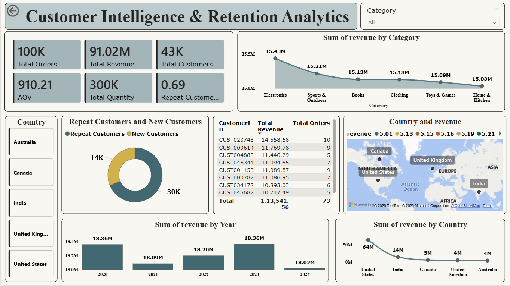
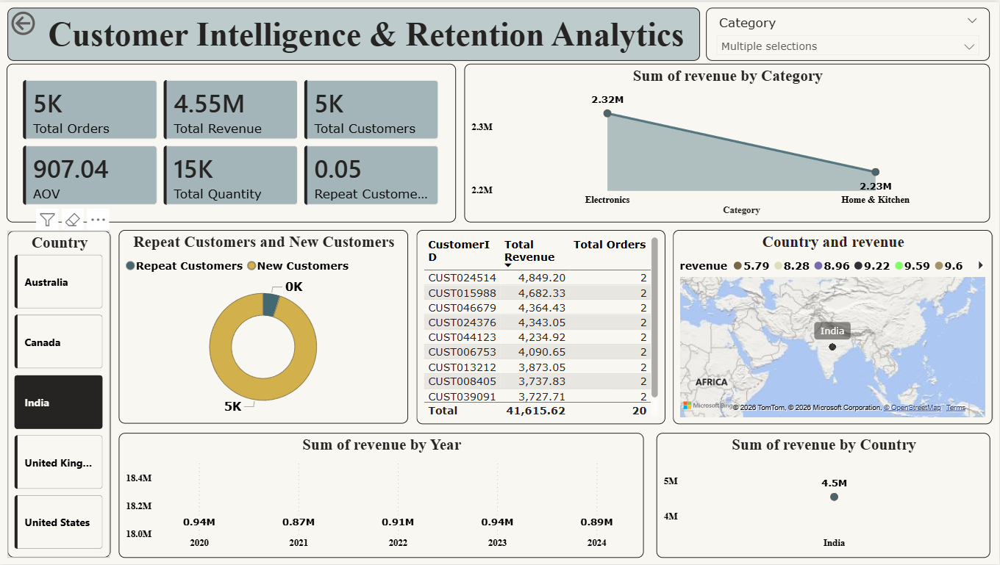
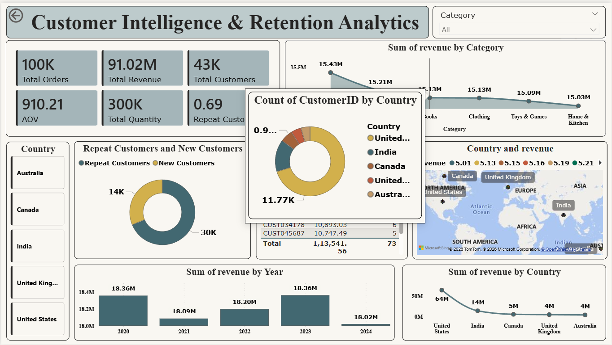
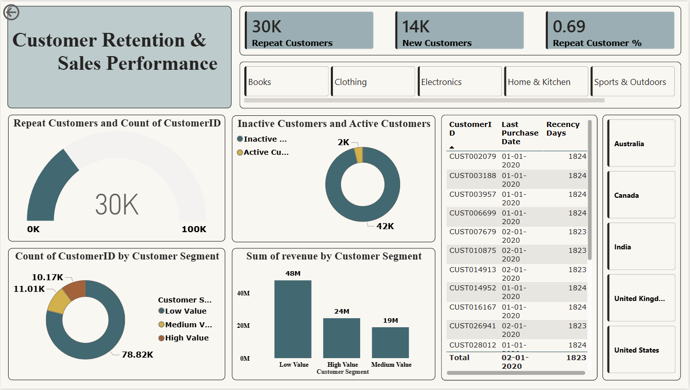
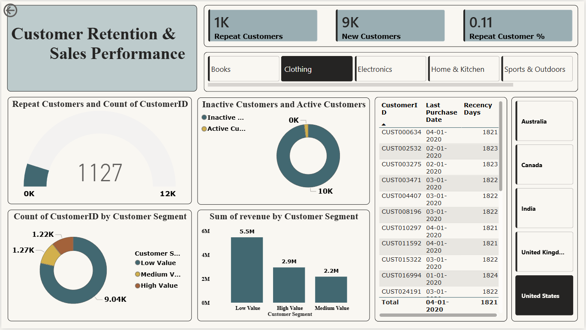
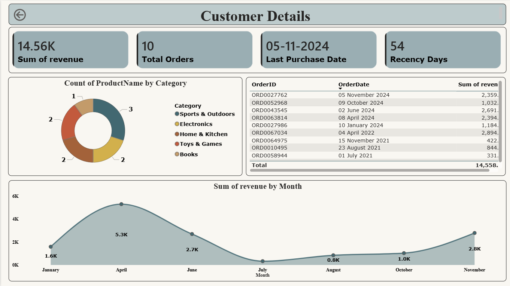
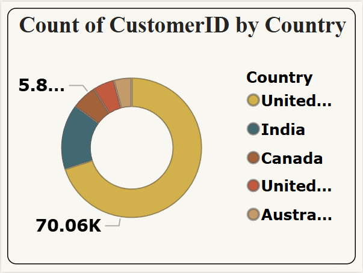

# 🚀 Customer Intelligence & Retention Analytics

## 📊 Project Overview
End-to-end analytics project on e-commerce data to uncover **customer behavior, revenue drivers, and retention (churn) patterns**.  
Delivers an interactive **Power BI** dashboard powered by **Python-based data cleaning** and **DAX measures**.

---

## 🧱 Workflow
Raw Data → **Python (Pandas) Cleaning** → **Power BI (Model + DAX)** → Interactive Dashboard

---

## ⚙️ Tech Stack
- Python (Pandas)
- Power BI (Data Model, DAX, Visualization)
- Excel / CSV (source)

---

## 🧹 Data Preparation (Python)
- Removed nulls & duplicates  
- Filtered invalid rows (negative qty, zero price)  
- Standardized dates  
- Created **Revenue = Quantity × UnitPrice**  

---

# 📊 Dashboard Preview

## 🟢 Main Dashboard


**What it shows:** KPIs (Revenue, Orders, Customers, AOV), category-wise sales, geo distribution.  
**Business use:** Quick executive snapshot of performance.

---

## 🔵 Filtered View


**What it shows:** Category/region filtered insights.  
**Business use:** Segment-focused decision making.


---

## 🟣 Tooltip Interaction


**What it shows:** Hover-based details without clutter.  
**Business use:** Fast exploration while keeping the canvas clean.

---

## 🟡 Retention & Sales Performance


**What it shows:** Active vs Inactive customers, repeat count, churn signals.  
**Business use:** Track retention health and churn risk.

---

## 🔶 Filtered View


**What it shows:** Category/region filtered insights.  
**Business use:** Segment-focused decision making.

---

## 🔍 Drillthrough – Customer Details


**What it shows:** Customer-level KPIs, order history, trends.  
**Business use:** Deep-dive into any customer.

---

## 🧠 Tooltip Detail View


**What it shows:** Customer distribution by country on hover.  
**Business use:** Geo insights without navigation.

---

# 📊 Pages
1. **Executive Overview** – KPIs, trends, category performance  
2. **Customer Intelligence & Retention** – segmentation, recency, churn  
3. **Product & Sales Performance** – product/category insights  
4. **Regional Analysis** – country/market view  
5. **Customer Details (Drillthrough)** – per-customer deep dive  

---

# 🧮 Key DAX (with purpose)

### Total Revenue
```DAX
Total Revenue = SUM(Orders[Revenue])
```

### Total Orders
```DAX
Total Orders = DISTINCTCOUNT(Orders[OrderID])
```


### Previous Month Revenue
```DAX
Previous Month Revenue = 
CALCULATE([Total Revenue], DATEADD(Date[Date], -1, MONTH))
```

### Revenue Growth %
```DAX
Revenue Growth % = 
VAR Prev = [Previous Month Revenue]
RETURN 
IF(
    NOT ISBLANK(Prev),
    DIVIDE([Total Revenue] - Prev, Prev),
    0
)
```
### Repeat Customers
```DAX
Repeat Customers = 
CALCULATE(
    DISTINCTCOUNT(Orders[CustomerID]),
    FILTER(
        VALUES(Orders[CustomerID]),
        CALCULATE(COUNT(Orders[OrderID])) > 1
    )
)
```

### Recency Days
```DAX
Recency Days = 
DATEDIFF(
    [Last Purchase Date],
    CALCULATE(MAX(Orders[OrderDate]), ALL(Orders)),
    DAY
)
```

### Inactive Customers (Churn Risk)
```DAX
Inactive Customers =
VAR LatestDate = CALCULATE(MAX(Orders[OrderDate]), ALL(Orders))
RETURN
CALCULATE(
    DISTINCTCOUNT(Orders[CustomerID]),
    FILTER(
        VALUES(Orders[CustomerID]),
        DATEDIFF(
            CALCULATE(MAX(Orders[OrderDate])),
            LatestDate,
            DAY
        ) > 30
    )
)
```


### Customer Rank
```DAX
Customer Rank = 
RANKX(
    ALL(Orders[CustomerID]),
    [Total Revenue],
    ,
    DESC
)
```


# 📈 Key Insights
- Top customers contribute major revenue  
- Identified inactive customers using recency logic  
- Category-wise sales trends observed  
- Region-wise performance differences  

---

# 💼 Business Value
- Improves customer retention strategies  
- Identifies high-value customers  
- Enables better business decisions  

---

# 🧠 Learning Outcomes
- End-to-end data analysis  
- Python data cleaning  
- Power BI dashboard development  
- Advanced DAX implementation  
