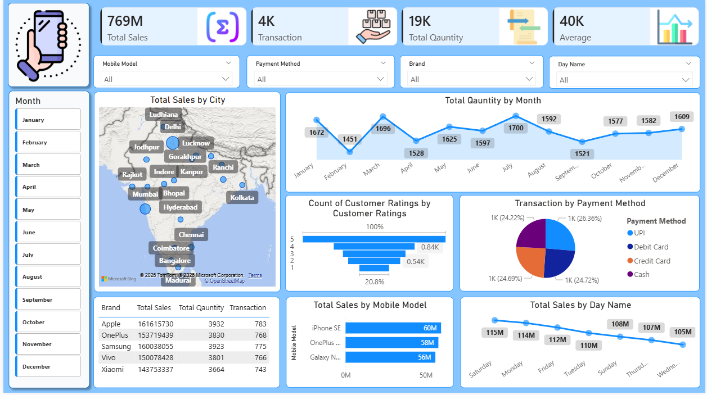
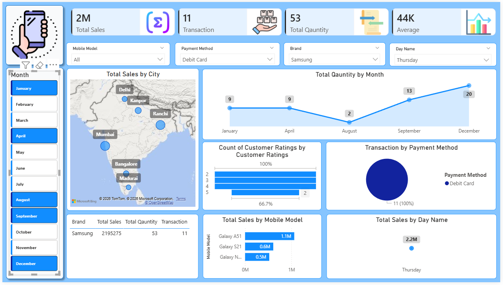

# 📊 E-Commerce Business Intelligence & Sales Analytics


---

## 🚀 Project Overview

**E-Commerce Business Intelligence & Sales Analytics** is an interactive Power BI dashboard designed to analyze sales performance and transform transactional data into meaningful business insights.

The project focuses on understanding **revenue performance, transaction trends, product and brand performance, customer ratings, payment behavior, and geographical sales patterns**.

The dashboard enables users to interactively explore business performance through dynamic filters and visualizations.

---

## 🎯 Business Objective

The objective of this project is to provide a centralized analytical solution that helps businesses:

- Monitor overall sales performance
- Track key business KPIs
- Identify top-performing brands and products
- Analyze sales trends over time
- Understand payment method preferences
- Compare geographical sales performance
- Analyze customer rating patterns
- Support data-driven business decisions

---

## 💡 Business Problem

Businesses dealing with large volumes of sales transactions often face challenges such as:

- Difficulty monitoring sales performance
- Lack of centralized KPI reporting
- Limited visibility into product and brand performance
- Difficulty identifying sales trends
- Limited understanding of customer payment preferences
- Manual reporting and analysis

### ✅ Proposed Solution

A **Power BI Business Intelligence dashboard** was developed to convert raw transactional data into an interactive analytical environment.

The solution provides:

- KPI-based performance monitoring
- Interactive dashboards
- Product and brand analysis
- Time-based sales analysis
- Geographical analysis
- Payment method analysis
- Customer rating insights
- Dynamic filtering

---

# 📊 Dashboard Overview

The dashboard provides multiple analytical views to understand business performance from different perspectives.

---

## 🏠 Main Dashboard

The main dashboard provides a consolidated view of overall business performance.

### Key KPIs

- 💰 Total Sales
- 🔄 Total Transactions
- 📦 Total Quantity
- 📊 Average Sales

### Analysis Included

- Sales by City
- Monthly Sales Trend
- Day-wise Sales Performance
- Brand Performance
- Top Mobile Models
- Payment Method Distribution
- Customer Rating Analysis

### Dashboard Preview



---

## 🎛️ Interactive Filter Analysis

The dashboard includes interactive slicers that allow users to dynamically analyze specific segments of the business.

### Available Filters

- Brand
- Model
- Month
- Payment Method
- Day Name

Users can combine multiple filters to drill down into specific sales segments.

### Filter Interaction Preview



---

# 📌 Dashboard Features

## 📈 KPI Analysis

The dashboard tracks the following key performance indicators:

| KPI | Description |
|---|---|
| Total Sales | Overall revenue generated |
| Total Transactions | Total number of sales transactions |
| Total Quantity | Total units sold |
| Average Sales | Average sales value per transaction |

---

## 🌍 Geographical Analysis

The dashboard provides city-level sales analysis using geographical visualization.

This helps identify:

- High-performing cities
- Revenue distribution by location
- Regional sales patterns
- Geographical opportunities

---

## 📅 Time-Based Analysis

Time intelligence is used to analyze sales performance across different periods.

### Analysis Includes

- Monthly sales trends
- Day-wise sales performance
- Sales fluctuations
- Period-based comparisons

---

## 📱 Product & Brand Analytics

Product-level analysis helps identify products and brands contributing significantly to overall sales.

### Analysis Includes

- Brand-wise sales comparison
- Top-performing brands
- Mobile model performance
- Product-level sales analysis

---

## 💳 Payment Method Analysis

The dashboard analyzes transactions across multiple payment methods:

- UPI
- Debit Card
- Credit Card
- Cash

This provides visibility into customer payment preferences and transaction distribution.

---

## ⭐ Customer Rating Analysis

Customer ratings are analyzed to understand overall customer satisfaction patterns.

The dashboard provides:

- Rating distribution
- Rating-based analysis
- Customer satisfaction trends

---

# 🧮 DAX Measures


Several DAX measures were created to calculate important business KPIs.

### Total Sales

```DAX
Total Sales = SUM(Sales[Total_Sales])
